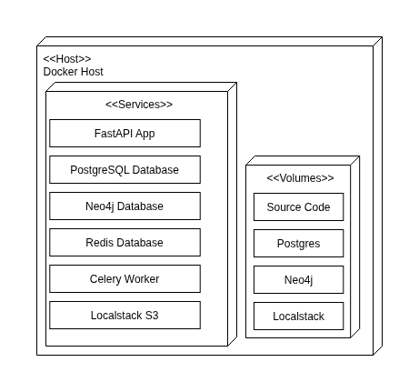
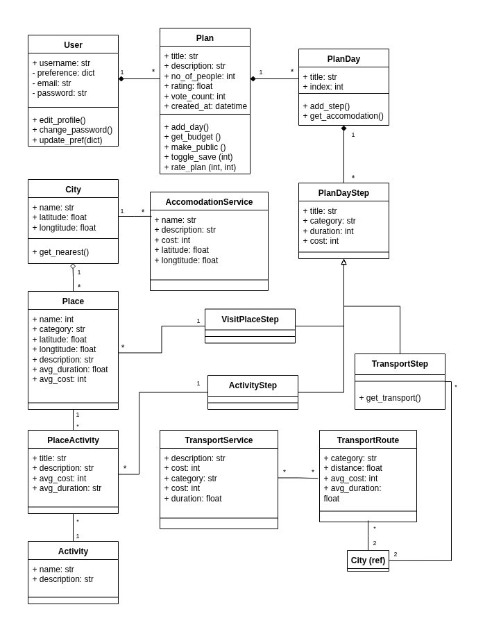

# HolidayNepal Backend

HolidayNepal is the backend service for the **HolidayNepal – AI Trip Planner**, a final year project designed to simplify and enhance travel planning within Nepal.
This backend is built with **FastAPI** and provides all the necessary APIs, background task processing, AI-powered plan generation, database management, and real-time WebSocket communication for the frontend application.

It follows a modular microservice-style architecture with containerized services orchestrated using **Docker Compose**.

-----

## Tech Stack

  - **FastAPI** – High-performance Python web framework for APIs
  - **PostgreSQL** – Relational database for structured data (users, places, itineraries)
  - **pgvector** – PostgreSQL extension for vector similarity search
  - **Neo4j** – Graph database for routes, shortest path queries, and graph-based optimization
  - **Redis** – In-memory store used as a message broker for background tasks
  - **Celery** – Asynchronous task queue for background processing 
  - **Localstack** – Local AWS S3 simulation for file and media storage
  - **Docker Compose** – Service orchestration for a reproducible development environment

-----

## Features

  - **User Authentication & Authorization**

      - JWT-based authentication with **access tokens** and **refresh tokens**.
      - OTP email verification for account confirmation and secure password resets.
      - **Google OAuth** login for simplified authentication via Google accounts.
      - Role-based access control for regular users and administrators.

  - **AI-Powered Trip Planning**

      - Generates personalized and detailed travel itineraries using a **Retrieval-Augmented Generation (RAG)** approach. This ensures the AI's suggestions are grounded in factual data from our database, making the plans relevant and practical.
      - Supports assisted editing to modify or enhance existing plans.
      - Utilizes WebSocket streaming for real-time plan generation.

  - **Route Optimization**

      - **Neo4j graph database** stores cities and routes as nodes and edges.
      - Implements Dijkstra’s algorithm for finding the shortest path based on cost, distance, or time.

  - **Itinerary Management**

      - Full CRUD functionality for travel plans (create, update, delete, save).
      - Allows CRUD within each day or steps as well as reordering steps within an itinerary.
      - Can rate itineraries, save/bookmark favorite plans, and duplicate others’ plans to create personalized versions
      - Features privacy controls (public/private plans).

  - **Profile & Admin Management**

      - Users can update personal info and travel preferences.
      - Admin panel APIs for managing places, activities, routes, and service providers.

  - **File Storage**

      - Localstack simulates AWS S3 for storing user-uploaded images and media assets.

-----

## Folder Structure

The backend follows a modular architecture to keep features and services well-organized:

```
├── alembic.ini
├── app
│   ├── core            # Shared utilities, DB repositories, schemas etc.
│   ├── database        # Database connections, migrations, seeders
│   ├── main.py         # FastAPI entrypoint
│   ├── middlerware     # Custom middlewares (auth, CORS)
│   ├── modules         # Feature-specific modules (users, places, plans, AI, etc.)
│   └── utils           # Helper functions, embeddings, scheduling, image processing, WebSocket helpers
├── docker              # Dockerfiles and initialization scripts
├── docker-compose.yml
├── requirements.txt
├── readme.md
└── tests               # Unit and integration tests
```

> Each module in `app/modules` contains its own models, routes, schemas, repository, and controllers, keeping the codebase maintainable and modular.

---

-----

## System Architecture

The system is designed with a service-oriented approach, where each containerized service handles a specific responsibility. The diagram below illustrates the services and volumes orchestrated by Docker Compose.


-----

## Database Schema Overview

This class diagram below provides a high-level overview of the main entities and their relationships within the PostgreSQL database, giving a clear idea of the core data structure.



-----

## Getting Started

Follow these steps to set up and run the backend services locally.

### 1. Clone the repository

```bash
git clone https://github.com/SudarshanPoudel/Holiday_Nepal_Backend.git
cd Holiday_Nepal_Backend
```

### 2. Configure Environment Variables

Rename `.env.example` file as `.env` and fill in missing configuration details (API keys, credientials etc.)

### 3. Unzip Seeder Images

The database seeder requires images, which are provided in a zip file, simply unzip `seeder-images.zip` in root folder. 

```bash
unzip seeder-images.zip
```

### 4. Run with Docker Compose

This command will build the images and start all the services defined in the `docker-compose.yml` file.

```bash
sudo docker compose up --build
```

### 5. Initialize the Database

After the containers are running, you need to execute the database migrations and seed the initial data. These commands must be run inside the `web` (FastAPI) container.

Open a new terminal and run:

```bash
# Run database migrations
sudo docker compose exec web alembic upgrade head

# Seed the database with initial data (places, routes, users, etc.)
sudo docker compose exec web python app/database/seeder/run_seeder.py
```

### 6. Access Services

Once everything is running, you can access the services at the following endpoints:

  - **FastAPI API Docs** → [http://localhost:8000/docs](https://www.google.com/search?q=http://localhost:8000/docs)
  - **PostgreSQL** → `localhost:5433`
  - **Neo4j Browser** → [http://localhost:7474](https://www.google.com/search?q=http://localhost:7474)
  - **Redis** → `localhost:6379`
  - **Localstack (S3)** → `http://localhost:4566`


### 7. Seeder & Default Users

The database seeder provides initial data for development and testing.

It seeds **two default users** for quick testing:

| Username | Password | Role  |
| -------- | -------- | ----- |
| user     | user     | User  |
| admin    | admin    | Admin |

These users can be used to test authentication, role-based access, and plan creation/editing.


-----

## Running the Full Application

This repository only contains the backend. To use the complete application, you also need to set up and run the frontend.

  - **Frontend Repository**: [HolidayNepal Frontend](https://github.com/SudarshanPoudel/Holiday_Nepal_Frontend)

Please follow the instructions in the frontend repository's README to get it running.